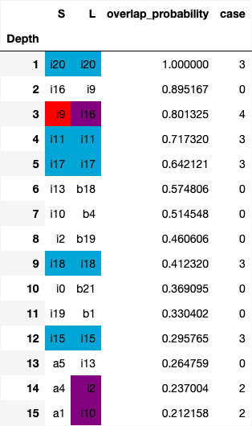
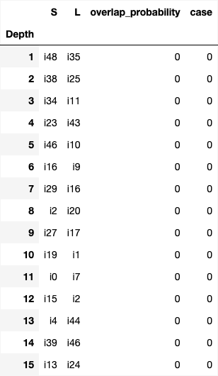
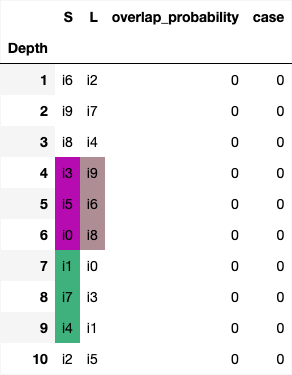

# Adaptive Synthetic Generation of Indefinite Rankings

<!--toc:start-->

- [Adaptive Synthetic Generation of Indefinite Rankings](#adaptive-synthetic-generation-of-indefinite-rankings)
  - [General](#general)
  - [Structure](#structure)
  - [Referencing this repository](#referencing-this-repository)
  <!--toc:end-->

## General

This is done as part of the Bachelor's Thesis (CSE3000) at the Delft University
of Technology. In this project, a novel method to generate synthetic rankings
is introduced, improving on the
[existing algorithm](https://github.com/julian-urbano/sigir2024-rbo)
implemented by Matteo Corsi and Julián Urbano. This new algorithm allows the
user to tune several aspects of the ranking such as the conjointness of ranking
domains and distribution of ties. The accompanying paper can be found on the
[TU Delft Education Repository](http://resolver.tudelft.nl/uuid:5894293f-02e2-48e5-8461-a07b75ad35c7).

## Structure

Sub-directories are arranged in the following manner:

- `src/`: final source code. Contains `simulate.py` and `standard_functions.py`
- `planning/`: this directory contains planning documents related to my final paper
- `exploratory/`: exploration scripts, this directory mainly contains Jupyter
  Notebook files.

## Usage

To generate a pair of rankings, `S` and `L`, we can run:

```Python
S, L, overlap_probabilities, case_list = simulate_rankings(a, b, len_x, len_y, overlap_probability_function)
```

- `overlap_probabilities` : for each depth, the output of `overlap_probability_function`
- `case_list` : the selected cases used to increase overlap. If we do not
  increase overlap, we choose case 0. See Table 1 in the accompanying paper for
  further details.

## Examples

1. Rankings with non-conjoint domains with the overlap probabilities derived
   from an exponential decay function. If no ties are specified, none will be
   created.

```Python
S, L, overlap_probabilities, case_list = simulate_rankings(a=30, b=50,
                                                len_x = 15, len_y = 15,
                                                overlap_probability_function=exponential_decay(theta=1),
                                                conjointness=0.4,
                                                truncate_rankings=True)
```



- red: item selected from `L`
- purple: item selected from `S`
- blue: same item added to both `S` and `L`

2. Rankings from fully conjoint domains with no overlap probability function
   provided. The generated rankings are completely random.

```Python
S, L, overlap_probabilities, case_list = simulate_rankings(a=50, b=50,
                                                len_x = 15, len_y = 15, 
                                                overlap_probability_function=zero(),
                                                conjointness=1,
                                                truncate_rankings=True)
```



3. Rankings from fully conjoint domains with uniform tie distributions

```Python
S, L, overlap_probabilities, case_list = simulate_rankings(a=10, b=10, len_x = 0, len_y = 0,
                                                 conjointness=1,
                                                 frac_ties_x=0.6,
                                                 n_groups_x=2,
                                                 frac_ties_y=0.3,
                                                 n_groups_y=1,
                                                 tie_probabilities_x=np.ones(10)/10,
                                                 tie_probabilities_y=np.ones(10)/10,
                                                truncate_rankings=False)
```


## Referencing this repository

To cite this repository, use the folowing:

```LaTex
@mastersthesis{sinha2024syntheticrankings,
    author = {Somdutta Sinha},
    title = {Adaptive Synthetic Ranking Generation of Indefinite Rankings},
    school = {Delft University of Technology},
    year = {2024},
    type = {Bachelor's Thesis},
    url = {http://resolver.tudelft.nl/uuid:5894293f-02e2-48e5-8461-a07b75ad35c7}
}
```
