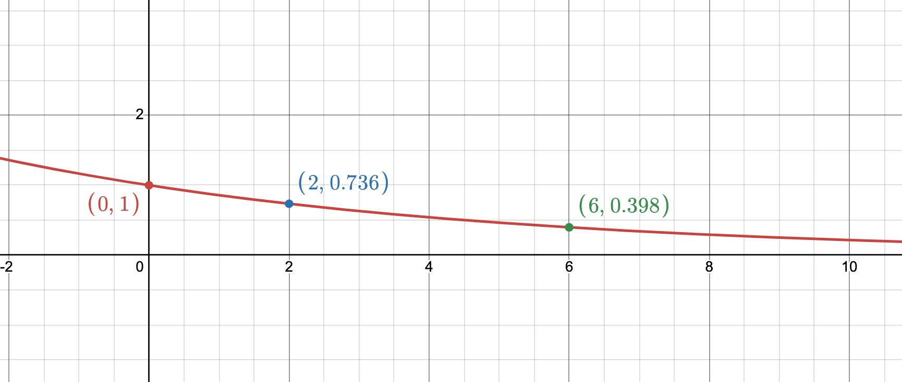

# Ranking Simulation Algorithm

<!--toc:start-->
- [Ranking Simulation Algorithm](#ranking-simulation-algorithm)
  - [Introduction](#introduction)
  - [Further Details](#further-details)
    - [Generating the domains](#generating-the-domains)
    - [Top-weightedness](#top-weightedness)
    - [Ties](#ties)
  - [Simulation Algorithm](#simulation-algorithm)
  - [Questions](#questions)
<!--toc:end-->

## Introduction

In approaching this research question, I have identified three main properties
of RBO that I would like to parametrise my simulation algorithm by:
conjointness, top-weightedness and the presence of ties in the rankings. So
far, I have been able to see how to incorporate conjointness into the ranking.
I have an idea on how to introduce top-weightedness, and I would like to start
on introducing ties this week.
 
 
The general outline of the algorithm is as follows:

1. Domains: Generate the domain for the two lists given some Jaccard similarity
   value
2. Sampling: From the generated domains, sample one item from each domain and
   add to S and L respectively. Sampling probability is influenced by the
   top-weightedness function.
3. Truncate both lists to desired length if requested.

## Further Details

### Generating the domains

- Let $A$ and $B$ be the domains from which the rankings $S$ and $L$ are drawn
  respectiveley
- The user gives some chosen Jaccard Similarity value as input, as well as the
  desired sizes of both domains $|A| = a$ and $|B| = b$
- Jaccard Similarity is calculated as:
  - $J(A, B) = \frac{|A \cap B|}{|A \cup B|}$
  - $|A \cup B| = a + b - |A \cap B|$
  - $J(A, B) (a + b - |A \cap B|) = |A \cap B|$
  - $J(A, B) (a + b) - J(A, B)(|A \cap B|) = |A \cap B|$
  - $J(A, B) (a + b) = J(A, B)(|A \cap B|) + |A \cap B|$
  - $|A \cap B| = \frac{J(A, B) (a + b)}{1 + J(A, B)}$
- From these derivations, we can find the size of the intersection. To ensure
  that this is an integer, we use the floor of the last term as the size of
  the intersection. Let this value be $p$.
- We generate $p$ items and add them to both $A$ and $B$.
- We then add $a - p$ uniquely labelled elements to $A$
- Finally, we add $b - p$ uniquely labelled elements to $B$

### Top-weightedness

- The goal is to assign a probability of increasing overlap to each depth.
- This probability function should be somehow parametrisable by the user
  depending on their desired level of 'top-weightedness'. A greater value of
  'top-weightedness' should lead to a higher probability of rank overlap at
  earlier depths. Intuitively, this leads to the notion of some sort of decay
  function.
- If the user wants 'no top-weightedness', the probability of increasing
  overlap should be $1/n$ (_not sure about this, see question 2_).
- We denote $\theta$ as the top-weightedness parameter and bound it between $0$
  and $1$ : $\theta \in [0, 1]$
- let this be: $f(x; \theta) = \theta (e^{-\frac{x}{k}}) + (1 - \theta) (\frac{1}{n})$
  where $x$ is the depth - $k$ is a scaling parameter that should be a
  monotonically increasing function of $n$ (size of the domain). This ensures
  that the shape of the function is consistent for different domain sizes.
  - To find $k$, we can say that for $\theta = 1$, we want that the overlap
    probability function 'crosses over' the function $f(x; \theta=0)$ at
    $x = 0.3n$. Formally, $f(0.3n; \theta = 1) = f(0.3n; \theta = 0)$. At this
    point, this assertion is purely arbitrary and can definitely be improved.
  - $e^{\frac{-0.3n}{k}} = \frac{1}{n}$
  - solving for $k$, we find that $k = \frac{0.3n}{ln(n)}$
  - The plot below shows an example of _$f(x, \theta=1)$_ when $n=100$

### Ties

(Will be started this week)

## Simulation Algorithm

Inputs (similar to the original simulation algorithm):

- `n` : length of the domain
- `len_x`, `len_y` : desired truncation lengths for $S$ and $L$
- `jaccard_similarity` : desired conjointness of the domains
- `theta` : desired degree of top-weightedness
- `overlap_probability_function` : (as per the advice given by Julián on Tuesday)
  some function `f` that should give the overlap probability given some depth $d$.
  At this point, my probability function which has been described is used.
- `return_truncated` : `True` if the user wants truncated rankings, else `False`

1. Generate domains $A$ and $B$ given a Jaccard similarity value
2. Create empty lists `S` and `L`
3. Initialize current depth `d` to 1
4. While the lengths of `S` and `L` are less than `n`, do:
   - find the current overlap probability : `p = f(d - 1)`
   - with probability `p`, either add:
      - an item from the intersection $S \cap (B - L)$ to `L`
      - an item from the intersection $(A - S) \cap L$ to `S`
      - an item from the intersection $(A - S) \cap (B - L)$ to both `S` and `L`
5. If `truncated_rankings = True`, truncate `S` to `len_x` and `L` to `len_y`
6. Return `S` and `L`

## Questions

1. Julián mentioned that we do not necessarily want to have overlap following a
   decaying function, and that the user should be able to choose what function
   they want. However, this seems like a contradiction to the research project's
   aim of 'tailoring synthetic ranking generation to RBO's properties', could you
   clarify what is meant by this?

2. What is the probability of increasing overlap completely randomly. i.e. if
   $\theta = 0$, what should the probability of increasing overlap be as $\frac{1}{n}$
   does not seem correct?

3. Evaluation: how deep should I go mathematically to 'prove' that my algorithm will
   generate rankings that are tailored to the properties of RBO - e.g. I could show
   that on expectation, my top-weightedness function will lead to $x\%$ of
   agreements in the first $n$ items etc. Or is showing this empirically enough
   (run several simulations with different hyperparameter values and showing
   that on average, the properties hold)?
